# 📊 BrainCoach AI: 10-Hour Sprint Timeline

```mermaid
gantt
    title BrainCoach AI Development Schedule
    dateFormat  HH:mm
    axisFormat %H:%M

    section Technical Build
    Phase 0: Setup           :a1, 00:00, 30m
    Phase 1: Backend         :a2, after a1, 90m
    Phase 2: Frontend        :a3, after a2, 90m
    Phase 3: Deploy          :a4, after a3, 30m

    section Media & Pitch
    Phase 4: Videos          :b1, after a4, 4h
    Phase 5: Pitch Deck      :b2, after b1, 90m

    section Submission
    Phase 6: Submit          :c1, after b2, 30m
```

## ⏰ Schedule breakdown
- **12:00 AM - 12:30 AM:** Phase 0 (Setup)
- **12:30 AM - 02:00 AM:** Phase 1 (Backend)
- **02:00 AM - 03:30 AM:** Phase 2 (Frontend)
- **03:30 AM - 04:00 AM:** Phase 3 (Deploy)
- **04:00 AM - 08:00 AM:** Phase 4 (Videos)
- **08:00 AM - 09:30 AM:** Phase 5 (Pitch Deck)
- **09:30 AM - 10:00 AM:** Phase 6 (Submit)

---
**GO VINITHA GO!** 🚀
